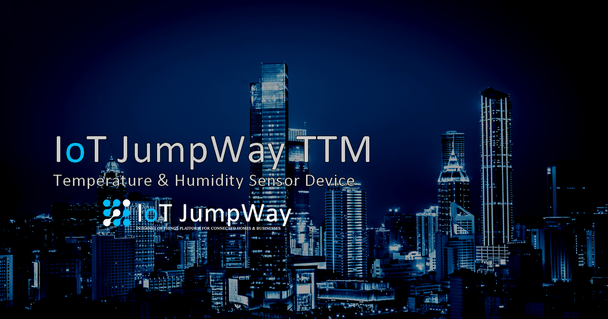

# IoT JumpWay TTM ESP8266 Arduino Device

## Introduction

The TTM Device is a temperature and humidity sensor device created on an ESP8266 12F and uses the IoT JumpWay for its device to device communication. 

## Required Software

- Arduino IDE (I used 1.8.4)
- IoTJumpWay
- PubSubClient
- ESP8266WiFi
- ArduinoJson
- DHT

## Required Hardware etc

- ESP8266 (I used 12F)
- Breadboard
- Wires
- USB Programmer
- Resistors
- DHT 

## Before You Begin

There are a few tutorials that you should follow before beginning, especially if it is the first time you have used the TechBubble IoT JumpWay Developer Program. If you do not already have one, you will require a TechBubble IoT JumpWay Developer Program developer account, and some basics to be set up before you can start creating your IoT devices. Visit the following [IoT JumpWay Developer Program Docs (5-10 minute read/setup)](https://github.com/TechBubbleTechnologies/IoT-JumpWay-Docs/ "IoT JumpWay Developer Program Docs (5-10 minute read/setup)") and check out the guides that take you through registration and setting up your Location Space, Zones, Devices and Applications (About 5 minutes read).

## TTM Device Connection Credentials & Settings

- Follow the [TechBubble Technologies IoT JumpWay Developer Program (BETA) Location Application Doc](https://github.com/TechBubbleTechnologies/IoT-JumpWay-Docs/blob/master/5-Location-Applications.md "TechBubble Technologies IoT JumpWay Developer Program (BETA) Location Application Doc") to set up your IoT JumpWay Location Application.

- Setup an IoT JumpWay Location Device for each IP camera you will be connecting to, and / or your Realsense camera. For this example, we only require the device ID for each camera, we will not be using the MQTT details for each camera as the application is capable of sending data on behalf of any device in its location. Follow the [TechBubble Technologies IoT JumpWay Developer Program (BETA) Location Device Doc](https://github.com/TechBubbleTechnologies/IoT-JumpWay-Docs/blob/master/4-Location-Devices.md "TechBubble Technologies IoT JumpWay Developer Program (BETA) Location Device Doc") to set up your devices.

## ESP8266 Setup Instructions

For this version of the setup instructions I will just give you the pin connections I used and explain the process using a FocaV2 programmer, but any programmer of that type should work, if you have a different version and try this out feel free to let us know how it went. 

## Pin Connections

Coming soon.

## Viewing Your Data

The TTM sends the temperature and humidity every 3 minutes as Sensor Data to the [TechBubble IoT JumpWay](https://iot.techbubbletechnologies.com/ "TechBubble IoT JumpWay"). You will be able to access the data in the [TechBubble IoT JumpWay Developers Area](https://iot.techbubbletechnologies.com/developers/dashboard/ "TechBubble IoT JumpWay Developers Area"). Once you have logged into the Developers Area, visit the [TechBubble IoT JumpWay Location Devices Page](https://iot.techbubbletechnologies.com/developers/location-devices "Location Devices page"), find your device and then visit the Sensor Data pages to view the data sent from the device, you can also see the device sleeping and waking up every 3 minutes in the status data.

## IoT JumpWay Arduino Bugs/Issues

Please feel free to create issues for bugs and general issues you come accross whilst using the IoT JumpWay Arduino Examples. You may also use the issues area to ask for general help whilst using the IoT JumpWay Arduino Examples in your IoT projects.

## IoT JumpWay Arduino Contributors

[Adam Milton-Barker, TechBubble Technologies Founder](https://github.com/AdamMiltonBarker "Adam Milton-Barker, TechBubble Technologies Founder")